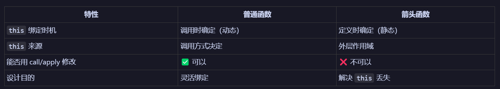

# JavaScript This 绑定基础知识

## This 绑定原理图示



## This 绑定的五种规则

### 1. 默认绑定（Default Binding）

独立函数调用时，`this` 指向全局对象（非严格模式）或 `undefined`（严格模式）。

```javascript
function foo() {
  console.log(this); // 非严格模式: window/global，严格模式: undefined
}

foo(); // 默认绑定
```

---

### 2. 隐式绑定（Implicit Binding）

当函数作为对象的方法调用时，`this` 指向该对象。

```javascript
const obj = {
  name: 'React',
  foo() {
    console.log(this.name); // 'React'
  }
};

obj.foo(); // 隐式绑定，this 指向 obj
```

**⚠️ 隐患：隐式丢失**

```javascript
const bar = obj.foo; // 只是提取函数，没有绑定 this
bar(); // 默认绑定，this 是 undefined（严格模式）
```

---

### 3. 显式绑定（Explicit Binding）

使用 `call`、`apply` 或 `bind` 强制绑定 `this`。

```javascript
function foo() {
  console.log(this.name);
}

const obj = { name: 'React' };

foo.call(obj);   // 'React'，显式绑定 this 到 obj
foo.apply(obj);  // 'React'，显式绑定 this 到 obj

const bar = foo.bind(obj);
bar();           // 'React'，永久绑定 this 到 obj
```

---

### 4. New 绑定（New Binding）

使用 `new` 调用构造函数时，`this` 指向新创建的对象。

```javascript
function Foo(name) {
  this.name = name; // this 指向新创建的对象
}

const obj = new Foo('React');
console.log(obj.name); // 'React'
```

---

### 5. 箭头函数绑定（Arrow Function Binding）

箭头函数没有自己的 `this`，捕获外层作用域的 `this`。

```javascript
const obj = {
  name: 'React',
  foo() {
    const arrow = () => {
      console.log(this.name); // 'React'，捕获了 foo 的 this
    };
    arrow();
  }
};

obj.foo();
```

**特性：**
- `this` 在**定义时**确定（词法作用域）
- 无法用 `call`、`apply`、`bind` 修改

---

## This 绑定的优先级

**优先级从高到低：**

1. `new` 绑定
2. 显式绑定（`call`、`apply`、`bind`）
3. 隐式绑定（对象方法调用）
4. 默认绑定（独立函数调用）

**箭头函数例外：** 箭头函数的 `this` 不参与优先级比较，它永远捕获外层作用域的 `this`。

---

## React 类组件中的 This 问题

### 问题代码

```typescript
class MyComponent extends React.Component {
  state = { count: 0 };

  handleClick() {
    this.setState({ count: this.state.count + 1 }); // ❌ this 是 undefined
  }

  render() {
    return (
      <button onClick={this.handleClick}>  {/* ❌ 回调函数，this 丢失 */}
        {this.state.count}
      </button>
    );
  }
}
```

### 问题原因

```typescript
// JSX 中的写法
<button onClick={this.handleClick}>

// 等价于
const callback = this.handleClick; // 只提取了函数，this 丢失
callback(); // 作为普通函数调用，this 是 undefined
```

---

### 解决方案

#### ✅ 方案 1：箭头函数属性（推荐）

```typescript
class MyComponent extends React.Component {
  state = { count: 0 };

  // 箭头函数捕获类实例的 this
  handleClick = () => {
    this.setState({ count: this.state.count + 1 }); // ✅ this 正确
  };

  render() {
    return (
      <button onClick={this.handleClick}>  {/* ✅ this 正确 */}
        {this.state.count}
      </button>
    );
  }
}
```

#### ✅ 方案 2：构造函数中绑定

```typescript
class MyComponent extends React.Component {
  constructor(props) {
    super(props);
    this.state = { count: 0 };
    this.handleClick = this.handleClick.bind(this); // 显式绑定
  }

  handleClick() {
    this.setState({ count: this.state.count + 1 }); // ✅ this 正确
  }

  render() {
    return (
      <button onClick={this.handleClick}>  {/* ✅ this 正确 */}
        {this.state.count}
      </button>
    );
  }
}
```

#### ✅ 方案 3：JSX 中使用箭头函数

```typescript
render() {
  return (
    <button onClick={() => this.handleClick()}>  {/* ✅ 箭头函数保持 this */}
      {this.state.count}
    </button>
  );
}
```

---

## 总结对比表

| 绑定方式 | This 指向 | 确定时机 | 可修改 |
|---------|----------|---------|-------|
| 默认绑定 | 全局对象 / undefined | 调用时 | - |
| 隐式绑定 | 调用对象 | 调用时 | - |
| 显式绑定 | 指定对象 | 调用时 | ✅ call/apply/bind |
| New 绑定 | 新创建对象 | 调用时 | - |
| 箭头函数 | 外层作用域的 this | 定义时 | ❌ 不可修改 |

---

## 最佳实践

1. **类组件中使用箭头函数属性**定义事件处理器
2. **避免在 JSX 中创建新的箭头函数**（方案 3 会导致每次渲染都创建新函数，影响性能）
3. **使用函数组件 + Hooks** 彻底避免 `this` 问题
4. **理解词法作用域**，正确使用箭头函数

---

## 参考资料

- MDN: [this](https://developer.mozilla.org/en-US/docs/Web/JavaScript/Reference/Operators/this)
- You Don't Know JS: [this & Object Prototypes](https://github.com/getify/You-Dont-Know-JS/tree/1st-ed/this%20%26%20object%20prototypes)
- React 官方文档: [Handling Events](https://react.dev/learn/responding-to-events)
